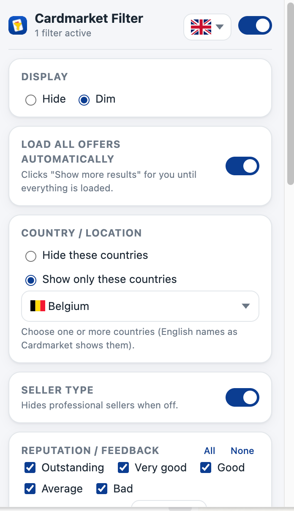
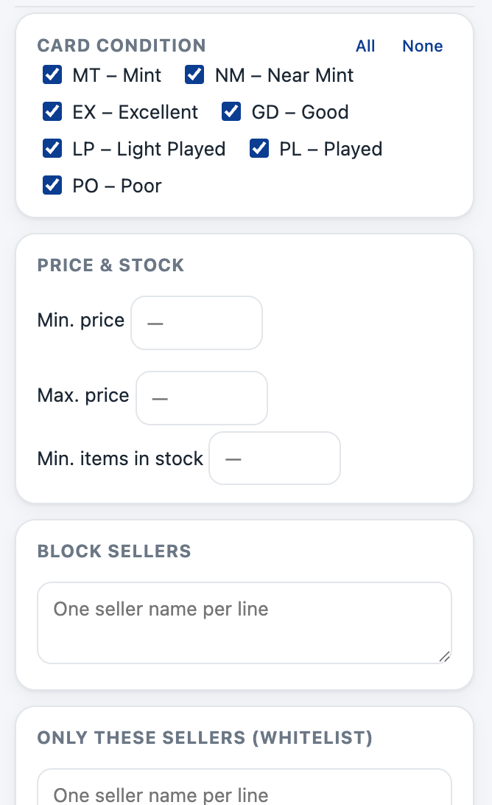
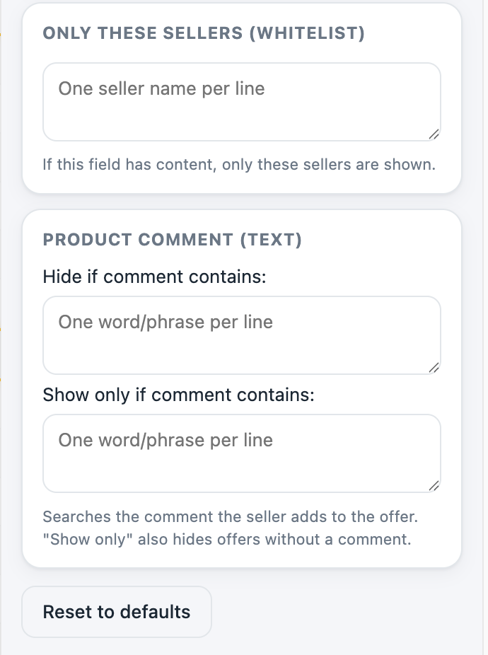
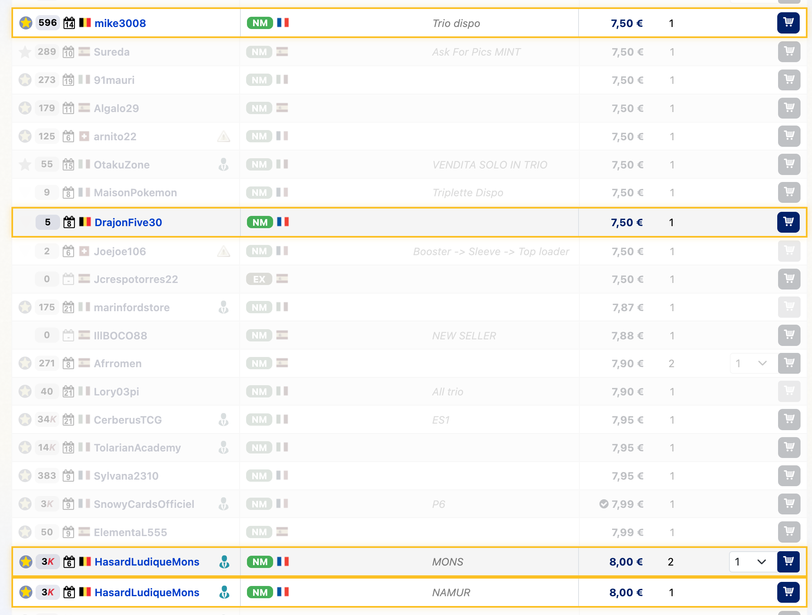

# Cardmarket Offer Filter

A Chrome extension (Manifest V3) that filters offers on **cardmarket.com**.

## Features

- **Multilingual** – choose your preferred language at the top of the settings panel: English (default), Dutch, French, Spanish, German, or Italian, each with flag icon.
- **Auto-load all offers** – automatically clicks "Show more results" until all offers are loaded (can be disabled).
- **Country / location** – select one or more countries via multi-select dropdown; hide these countries or show only these countries.
- **Card language** – filter offers by card language (English, Japanese, German, etc.) with multi-select dropdown.
- **Seller type** – show or hide professional sellers with a single toggle.
- **Reputation / feedback** – filter by feedback level (Outstanding … Bad) when visible in the row.
- **Card condition** – show only desired conditions (MT, NM, EX, GD, LP, PL, PO).
- **Price & stock** – min/max price and minimum stock quantity.
- **Blocklist / whitelist** – block specific sellers or show only a whitelist.

Settings are applied live (via `chrome.storage`) and re-evaluated on page changes and navigation within the site.

## Screenshots

### Settings Panel




### Dim Mode in Action


*Filtered offers are dimmed (gray, low opacity) while matching offers are highlighted with a yellow border for easy scanning.*

## Cross-Platform Compatibility

- ✅ **Works on Windows, macOS, and Linux**
- ✅ **Flag icons display correctly on all platforms** using SVG (no broken emoji on Windows!)
- ✅ All features tested on Chrome/Edge/Brave

## Installation (unpacked)

1. Open Chrome and go to `chrome://extensions`.
2. Enable **Developer mode** in the top right.
3. Click **Load unpacked** and select the `ChromeCardmarket` folder.
4. Open a Cardmarket offer page and click the extension icon to configure filters.

## Files

| File | Purpose |
| --- | --- |
| `manifest.json` | Extension configuration (MV3). |
| `defaults.js` | Shared constants, default settings, and CSS selectors. |
| `i18n.js` | Translations for the settings panel (6 languages). |
| `content.js` | Reads offers and hides/dims rows. |
| `content.css` | Hide/dim effect and count badge. |
| `popup.html` / `popup.js` / `popup.css` | Settings panel. |
| `icons/` | Extension icons (SVG source + PNG files at 16/32/48/128 px). |

### Regenerating Icons (Optional)

The PNG icon files are included in the repository. If you want to regenerate them from `icons/icon.svg`:

**macOS:**
```bash
cd icons
qlmanage -t -s 1024 -o . icon.svg
mv icon.svg.png icon-temp.png
sips -z 16 16 icon-temp.png --out icon-16.png
sips -z 32 32 icon-temp.png --out icon-32.png
sips -z 48 48 icon-temp.png --out icon-48.png
sips -z 128 128 icon-temp.png --out icon-128.png
rm icon-temp.png
```

**Windows/Linux (with ImageMagick):**
```bash
cd icons
magick icon.svg -resize 16x16 icon-16.png
magick icon.svg -resize 32x32 icon-32.png
magick icon.svg -resize 48x48 icon-48.png
magick icon.svg -resize 128x128 icon-128.png
```

**Or use an online converter:** Upload `icon.svg` to [cloudconvert.com](https://cloudconvert.com/svg-to-png) or similar.

## Adjusting selectors

Cardmarket occasionally changes its HTML. If a filter stops working:

1. In `content.js`, change `const DEBUG = false;` to `true`.
2. Reload the extension and open the console (F12) on an offer page.
3. Review the extracted data per row and adjust `CM_SELECTORS` in `defaults.js` as needed.

## Limitations

- Reputation and seller type are only filtered if visible in the offer row (tooltip/title). Rows without that info remain visible.
- Shipping costs are not shown per row by Cardmarket; the price filter uses the item price.
